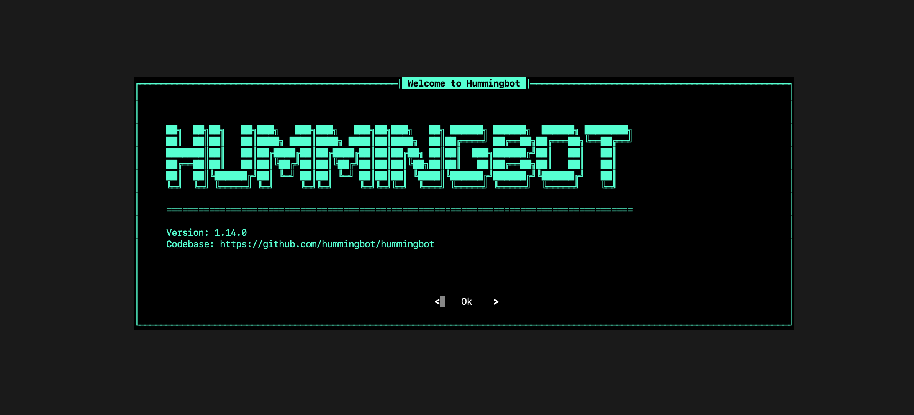

# Auto-Start Hummingbot Instance

This installs a single [Hummingbot](https://github.com/hummingbot/hummingbot) instance as a Docker container and automatically starts running a pre-configured script or strategy.

## Prerequisites

This configuration requires [Docker Compose](https://docs.docker.com/compose/), a tool for defining and running multi-container Docker applications. The recommended way to get Docker Compose is to install [Docker Desktop](https://www.docker.com/products/docker-desktop/), which includes Docker Compose along with Docker Engine and Docker CLI which are Compose prerequisites.

See [Docker](../DOCKER.md) for more information about how to install and use Docker Compose, as well as helpful commands.

## Getting Started

Auto-starting a script/strategy lets you start a bot from the command line, skipping the Hummingbot UI. 

To enable this, you will do need a few things first:
- Install and configure the Hummingbot instance
- Set the password used to encrypt your keys (`CONFIG_PASSWORD`)
- Define your script or strategy config file that you want to auto-start (`CONFIG_FILE_NAME`)

First, let's check that you have installed Docker Compose successfully. In Terminal/Bash, Run the following command:
```
docker compose
```

You should see a response that start with:
```
Usage:  docker compose [OPTIONS] COMMAND
```

### 1. Launch network

Clone this repo to your machine and go to the folder:
```
git clone https://github.com/hummingbot/deploy-examples.git
cd deploy-examples/autostart_hummingbot_compose
```

Alternatively, copy the `docker-compose.yml` file to a directory on your machine where you want to store your Hummingbot files. 

This is the "root folder" where your encrypted keys, scripts, trades, configs, logs, and other files related to your bots will be saved.

From the root folder, run the following command to pull the image and start the instance:
```
docker compose up -d
```

After the images have been downloaded, you should see the following output:
```
[+] Running 1/1
 ⠿ Container hummingbot       Started 
 ```

### 3. Set permissions

Run this command from your root folder to grant read/write permission to the `hummingbot_files` sub-folder:
```
sudo chmod -R a+rw ./hummingbot_files
```


### 4. Launch Hummingbot and set password

Now, attach to the `hummingbot` instance:
```
docker attach hummingbot
```

You should see the Hummingbot welcome screen:



Set your Hummingbot [password](https://docs.hummingbot.org/operation/password/) and write it down. This is the `CONFIG_PASSWORD` environment variable in your `docker-compose.yml` file.

Afterwards, run `exit` to exit Hummingbot. 


### 4. Define script/strategy file

You can auto-start either a Script or a Strategy:

* [Scripts](https://docs.hummingbot.org/scripts/) are Python files that contain all strategy logic. If you define a `.py` file as `CONFIG_FILE_NAME`, Hummingbot assumes it's a script file and looks for the `.py` file in the `hummingbot_files/scripts` directory. See [`simple_pmm_example.py`](./hummingbot_files/scripts/simple_pmm_example.py) for an example.
* [Strategies](https://docs.hummingbot.org/strategies/) are configurable strategy templates. If you define a `.yml` file as `CONFIG_FILE_NAME`, Hummingbot assumes it's a strategy config file and looks for the `.yml` file in the `hummingbot_files/conf/strategies` directory. See [`conf_pure_mm_1.yml`](./hummingbot_files/conf/strategies/conf_pure_mm_1.yml) for an example.

### 5. Modify YAML file

Now, use an IDE like [VSCode](https://code.visualstudio.com/) to edit the `docker-compose.yml` file.

Edit the section that defines the `CONFIG_PASSWORD` and `CONFIG_FILE_NAME` environment variables:
```yaml
    # environment:
      # - CONFIG_PASSWORD=[password]
      # - CONFIG_FILE_NAME=simple_pmm_example.py
      # - CONFIG_FILE_NAME=conf_pure_mm_1.yml
```

Uncomment out:
 * The `environment:` line
 * The `CONFIG_PASSWORD` line: add the password you set earlier,
 * One of `CONFIG_FILE_NAME` lines: add your script OR strategy config file
 
 The final `environment` section of the YAML file should look like this:
```yaml
    environment:
      - CONFIG_PASSWORD=[password]
      - CONFIG_FILE_NAME=simple_pmm_example.py
```

Afterwards, save the file.

### 6. Relaunch Hummingbot

Restart the container using your new YAML file:
```
docker stop hummingbot
docker start hummingbot
```

When you attach to it, the strategy or script should already be running:
```
docker attach hummingbot
```
