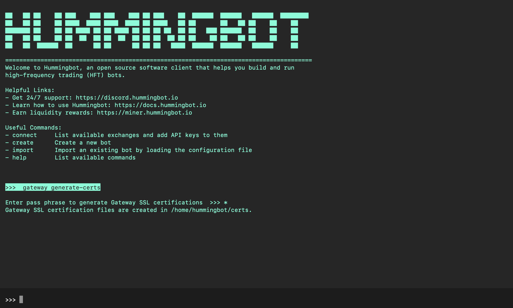

# Deploy Hummingbot and Gateway Instances

This installs a [Hummingbot](https://github.com/hummingbot/hummingbot) instance linked to a [Hummingbot Gateway](https://github.com/hummingbot/gateway) instance.

## Prerequisites

This configuration requires [Docker Compose](https://docs.docker.com/compose/), a tool for defining and running multi-container Docker applications. The recommended way to get Docker Compose is to install [Docker Desktop](https://www.docker.com/products/docker-desktop/), which includes Docker Compose along with Docker Engine and Docker CLI which are Compose prerequisites.

See [Docker](../DOCKER.md) for more information about how to install and use Docker Compose, as well as helpful commands.

## Getting Started

Installing Hummingbot alongside Gateway lets you access data and execute orders on DEX connectors.

To enable this, you will do need a few things first:
- Install and configure the Hummingbot and Gateway instances
- Generate self-signed certificates in Hummingbot
- Give Gateway the passphrase used to generate the certificates (`GATEWAY_PASSPHRASE`)

Verify that Docker Compose is installed correctly by checking the version:

```bash
docker compose version
```

The output should be: `Docker Compose version v2.17.2` or similar. Ensure that you are using Docker Compose V2, as V1 is deprecated.

### 1. Launch network

Clone this repo to your machine and go to the folder:
```
git clone https://github.com/hummingbot/deploy-examples.git
cd deploy-examples/hummingbot_gateway_compose
```

Alternatively, copy the `docker-compose.yml` file to a directory on your machine where you want to store your Hummingbot files. 

This is the "root folder" where your encrypted keys, scripts, trades, configs, logs, and other files related to your bots will be saved.

From the root folder, run the following command to pull the image and start the instance:
```
docker compose up -d
```

After the images have been downloaded, you should see the following output:
```
[+] Running 3/3
 ⠿ Network hummingbot_gateway_compose_default     Created
 ⠿ Container hummingbot                           Started
 ⠿ Container gateway                              Started       
```

### 2. Set permissions

Run this command from your root folder to grant read/write permission to the `hummingbot_files` and `gateway_files` sub-folders:
```
sudo chmod -R a+rw ./hummingbot_files ./gateway_files
```

You may run into read-only permission issues if you don't do this.

### 3. Add token lists

Populate Gateway lists folder from token lists from the Gateway image:
```
docker cp gateway:/home/gateway/src/templates/lists/. ./gateway_files/conf/lists/
```

This step is needed to being able to interpret token symbols. Otherwise, you'll get "Token not supported" errors when you run Hummingbot. You can also copy individual [token lists](https://github.com/hummingbot/gateway/tree/main/src/templates/lists) into the `hummingbot_files/conf/lists` folder to make them available to your instance.

### 4. Add scripts

Populate Hummingbot scripts folder with example scripts from the Hummingbot image:
```
docker cp hummingbot:/home/hummingbot/scripts-copy/. ./hummingbot_files/scripts/
```

This step is needed to being able to run the script examples. You can also copy individual [script examples](https://github.com/hummingbot/hummingbot/tree/master/scripts) into the `hummingbot_files/scripts` folder to make them available to your instance.


### 5. Launch Hummingbot and generate certificates

Now, attach to the `hummingbot` instance:
```
docker attach hummingbot
```

You should see the Hummingbot welcome screen:


Set your Hummingbot [password](https://docs.hummingbot.org/operation/password/) and write it down. This is the `CONFIG_PASSWORD` environment variable in your `docker-compose.yml` file.

Run the following command to generate Gateway certificates:
```
gateway generate-certs
```


You'll be prompted for a passphrase used to generate the certificates. This is the `GATEWAY_PASSPHRASE` environment variable in your `docker-compose.yml` file.

Hummingbot will use the passphrase to generate the certificates and save them in the `hummingbot_files/certs` folder, which is mapped to the `/home/hummingbot/certs` in the image. This location is also mapped to `/home/gateway/certs`, where the Gateway instance will look for the certificates it needs.

Afterwards, run `exit` to exit Hummingbot.

### 6. Remove network

Once you're back in Bash/Terminal, run the following command to remove the Compose project:
```
docker compose down
```

You should see the following output:
```
[+] Running 3/3 
 ⠿ Container gateway                            Removed
 ⠿ Container hummingbot                         Removed
 ⠿ Network hummingbot_gateway_compose_default   Removed
```  

### 7. Modify YAML file

Now, use an IDE like [VSCode](https://code.visualstudio.com/) to edit the `docker-compose.yml` file.

Edit the section that defines the `CONFIG_PASSWORD` and `CONFIG_FILE_NAME` environment variables:
```yaml
  hummingbot:
    # environment:
      #  - CONFIG_PASSWORD=[password]
  gateway:
    # environment:
      #  - GATEWAY_PASSPHRASE=[passphrase]
```

Uncomment out:
 * The `environment:` lines
 * The `CONFIG_PASSWORD` lines: add your Hummingbot password
 * The `GATEWAY_PASSPHRASE` line: add the passphrase you used to generate the certificates

The final `environment` section of the YAML file should look like this:
```yaml
  hummingbot:
    environment:
      - CONFIG_PASSWORD=[password]
  gateway:
    environment:
      - GATEWAY_PASSPHRASE=[passphrase]
```

Afterwards, save the file.

### 8. Recreate network

Now, recreate the Compose project:
```
docker compose up -d
```

Attach to the `hummingbot` instance. If you have defined `CONFIG_PASSWORD` in the YAML file, you don't need to enter it again:
```
docker attach hummingbot
```
After you enter your password, you should now see `GATEWAY:ONLINE` in the upper-right hand corner.

Open a new Terminal/Bash window. In it, attach to the `gateway` instance to see its logs:
```
docker attach gateway
```
See [Gateway](https://docs.hummingbot.org/gateway/) for more details on how to configure it for use with Hummingbot.

To get started with Hummingbot, check out the following docs:

* [Basic Features](https://docs.hummingbot.org/operation/)
* [Quickstart Guide](https://docs.hummingbot.org/quickstart/)
* [Hummingbot FAQ](https://docs.hummingbot.org/faq/)

For Gateway, check out the following docs:

* [Testing with Postman](https://docs.hummingbot.org/gateway/testing/)
* [Using Gateway with Hummingbot](https://docs.hummingbot.org/gateway/setup/)
